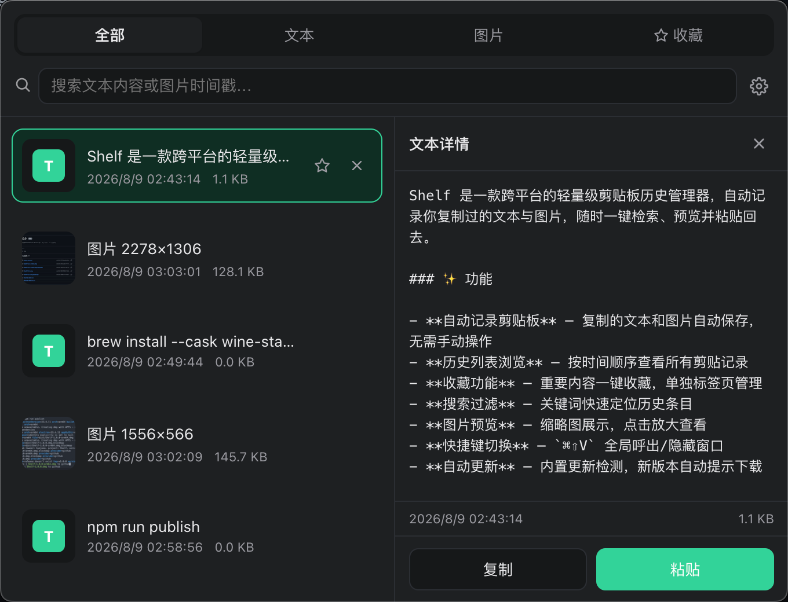

# Shelf

> 你的剪贴板「置物架」——把复制过的内容统统收好，随时取用。

**Shelf** 是一款跨平台桌面剪切板管理工具（**macOS 10.15+ / Windows 10+**），自动帮你捕获、整理和回放复制过的文本与图片。



## ✨ 功能

- 自动捕获文本与图片，按内容去重
- 分类标签页：全部 / 文本 / 图片 / 收藏
- 实时模糊搜索，随手定位历史片段
- 单击预览、双击粘贴回原应用（智能处理失焦）
- 收藏置顶、单条删除、一键清空
- 本地持久化，超量自动清理（收藏永久保留）
- 菜单栏 / 托盘常驻，全局快捷键一键唤起

## 🚀 使用

1. 从 [Releases](../../releases) 下载对应平台安装包（macOS `dmg` / Windows `exe`），或用源码自行构建：

   ```bash
   npm install
   npm run dist:mac   # 打包 macOS
   npm run dist:win   # 打包 Windows
   ```

2. 启动后，按默认快捷键 **`Cmd/Ctrl + Shift + V`** 唤起面板；再按一次收起。
3. 在列表里单击预览、双击即可把内容粘贴回你刚才操作的窗口。

## 🖥 平台说明

- **macOS**：粘贴功能需要在「系统设置 → 隐私与安全性 → 辅助功能」中授权 Shelf；托盘常驻时会隐藏 Dock 图标。
- **Windows**：开机自启通过安装器注册；粘贴使用系统快捷键模拟。

## 📦 发布（维护者）

自动更新依赖 GitHub Releases 元数据（`latest.yml` 等），必须用 publish 流程发布，不要手动上传安装包。

```bash
# 1. 生成有 repo 权限的 GitHub Token，导出为环境变量（建议写入 ~/.zshrc）
export GH_TOKEN=你的token

# 2. 打包 + 自动创建 Release + 上传安装包与更新元数据
npm run publish
```

> 仅本地出包不上传：`npm run dist:mac` / `npm run dist:win`。

## 📄 License

[MIT](./LICENSE)
