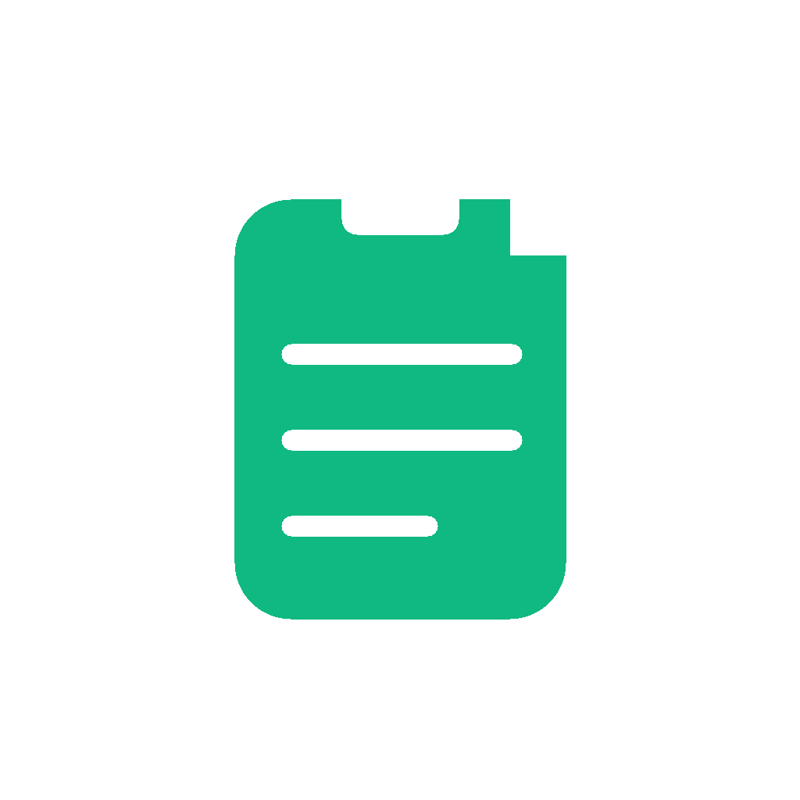

<div align="center">



# Shelf

**Your clipboard's shelf — everything you copy, neatly stored and always at hand.**

A lightweight, cross-platform clipboard history manager for **macOS 10.15+** and **Windows 10+**.
Shelf runs quietly in the background, capturing and organizing every piece of text and every image you copy, so you can search, preview and paste it back whenever you need it.

[](https://github.com/hyojooo/Shelf/releases/latest)
[](https://github.com/hyojooo/Shelf/releases)
[](./LICENSE)
[](#-platform-support)

**English** &nbsp;·&nbsp; [简体中文](README.zh-CN.md)

</div>


---

## ✨ Features

- **Automatic capture** — copied text and images are saved in the background; no extra action required
- **Smart deduplication** — re-copying the same content refreshes its position instead of creating duplicates
- **Tabbed browsing** — switch between All / Text / Images / Favorites
- **Instant search** — fuzzy, real-time filtering across your whole clipboard history
- **Click to preview, double-click to paste** — paste directly back into the app you were just using, with focus handling
- **Favorites** — pin what matters most; favorites are never touched by automatic cleanup
- **Image preview & zoom** — thumbnails in the list, click to view the full-size original
- **Global hotkey** — one keystroke to summon or hide the panel
- **Local & persistent** — history is stored on your machine only, with automatic pruning of older entries
- **Menu bar / tray resident** — always one shortcut away, without cluttering your Dock
- **Built-in auto-update** — new versions are detected, downloaded and installed in place

## 📦 Install

### Download

Grab the installer for your platform from the [Releases](https://github.com/hyojooo/Shelf/releases) page:

| Platform | Package |
| --- | --- |
| macOS (Apple Silicon / Intel) | `.dmg` |
| Windows 10+ | `.exe` |

### Build from source

```bash
git clone https://github.com/hyojooo/Shelf.git
cd Shelf
npm install

npm run dev        # run in development mode
npm run dist:mac   # package for macOS
npm run dist:win   # package for Windows
```

Requires Node.js 18 or newer.

## 🚀 Usage

1. Launch Shelf — it stays in the menu bar (macOS) or system tray (Windows).
2. Press **`Cmd + Shift + V`** (macOS) or **`Ctrl + Shift + V`** (Windows) to summon the panel. Press it again to hide it.
3. Single-click an item to preview it; double-click to paste it straight back into the window you were just working in.

### Keyboard shortcuts

| Shortcut | Action |
| --- | --- |
| `↑` / `↓` | Move the selection |
| `⌘/Ctrl + F` | Focus the search box |
| `⌘/Ctrl + C` | Copy the selected item |
| `Enter` | Copy or paste the selected item (depending on your settings) |
| `Delete` / `Backspace` | Delete the selected item |
| `Esc` | Close the preview / clear the selection |

## 🖥 Platform support

**macOS 10.15+**

- Pasting requires Accessibility permission: **System Settings → Privacy & Security → Accessibility → enable Shelf**.
- While resident in the menu bar, the Dock icon is hidden.

**Windows 10+**

- Launch at login is registered by the installer.
- Pasting is performed by simulating the system paste shortcut.

## 🛠 Tech stack

Electron · React 18 · TypeScript · Vite (electron-vite) · Zustand · electron-builder / electron-updater

## 🤝 Contributing

Issues and pull requests are welcome. If Shelf is useful to you, a ⭐ helps other people find it.

## 📄 License

[MIT](./LICENSE) © [hyojooo](https://github.com/hyojooo)

<div align="center">
<sub><a href="README.zh-CN.md">简体中文文档</a></sub>
</div>
